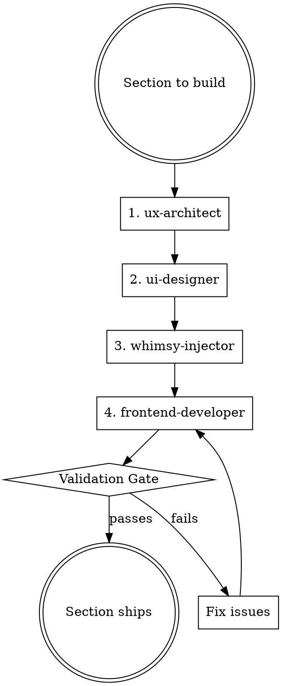

# Build Section

## Overview

A quality gate for building each portfolio section. Ensures the right agent makes the right decision at the right time — structure before visuals, visuals before code, personality before shipping.

**Core principle:** No section ships without all 4 agents signing off in order.

## When to Use

- Before building any new section (Hero, Nav, Services, Case Study, etc.)
- When resuming work on a partially built section
- When a section feels inconsistent with the rest of the design

**Do NOT skip this workflow** because a section seems simple. The most common failures happen on "simple" sections.

## The 4-Agent Workflow



## Agent Responsibilities

| Agent | Decides | Does NOT decide |
|---|---|---|
| `ux-architect` | Section structure, content order, spacing rhythm, scroll behavior | Colors, fonts, animations |
| `ui-designer` | Colors, typography sizes, component variants, hover states | Layout structure, copy |
| `whimsy-injector` | Y2K badge placement, italic accent words, sticker rotation, playful copy | Code implementation |
| `frontend-developer` | JSX structure, Tailwind classes, Framer Motion code, responsiveness | Visual design decisions |

## Step-by-Step

### Step 1 — ux-architect: Structure
Read `docs/specs/2026-03-15-portfolio-design.md` section for this component.
Answer before writing any code:
- What is the content hierarchy?
- What does the user see first, second, third?
- How does this section connect to the one before and after it?
- What changes on mobile?

### Step 2 — ui-designer: Visuals
Using the structure from Step 1, lock down:
- Which color tokens apply (from CLAUDE.md color system)
- Typography: which font, which weight, which size at each breakpoint
- Spacing: padding and gap values in Tailwind units
- Interaction states: hover, focus, active (reference CLAUDE.md interaction table)

### Step 3 — whimsy-injector: Personality
Review the section and ask:
- Does this section need a Y2K badge sticker? Where, what rotation?
- Is there a headline word that should be italic + AI Accent colored?
- Does any copy feel too corporate? Loosen it.
- Is the section visually interesting or does it feel like every other portfolio?

### Step 4 — frontend-developer: Code
Build the component using all decisions from Steps 1–3.

**Non-negotiable rules (from CLAUDE.md):**
- [ ] No emoji in JSX — Lucide icons only
- [ ] All looping Framer Motion animations use `useReducedMotion`
- [ ] Fonts loaded via `next/font/google` (never CDN `<link>`)
- [ ] Mobile-first Tailwind classes (`base → sm → md → lg`)
- [ ] `✦` nav ornament is Unicode U+2726 — do not replace with icon
- [ ] Contact CTA uses `mailto:` — no form backend
- [ ] Persistent floating `Hire Us →` button on mobile

## Validation Gate

Before marking a section complete, verify all of the following:

**Design System**
- [ ] Only uses color tokens defined in CLAUDE.md
- [ ] Bricolage Grotesque for headlines, Inter for body
- [ ] At least one Y2K element present (badge, italic accent, pill tag, or dark/light contrast)

**Code Quality**
- [ ] Component is mobile-first
- [ ] All touch targets are minimum 44×44px
- [ ] No inline styles — Tailwind classes only
- [ ] Framer Motion `useReducedMotion` applied to all loops

**Accessibility**
- [ ] All interactive elements have focus ring (`ring-2 ring-[#5B5BFF] ring-offset-2`)
- [ ] Images have `alt` text
- [ ] Color contrast passes AA (dark text on light backgrounds)

**Integration**
- [ ] Section connects visually to the section above it
- [ ] Section anchor ID matches the nav link target

## Common Mistakes

| Mistake | Fix |
|---|---|
| Writing code before locking visuals | Always complete Steps 1–3 before Step 4 |
| `frontend-developer` choosing colors | Colors are `ui-designer`'s job — go back to Step 2 |
| Skipping `whimsy-injector` on "simple" sections | Every section needs a personality check |
| Using emoji as icons | Replace with Lucide — `import { Bot } from 'lucide-react'` |
| Forgetting `useReducedMotion` on badge float | Lighthouse accessibility will fail |
| Mobile styles added as afterthought | Write mobile class first, scale up with `md:` prefix |

## Quick Reference — Color Tokens

```
bg-[#FEFEFE]   → page base
bg-[#111111]   → dark sections, near-black text
text-[#5B5BFF] → AI accent, italic highlights
bg-[#FFE500]   → Y2K yellow badges
bg-[#FF6B6B]   → sticker red tags
text-[#AAAAAA] → muted labels, section subtitles
bg-[#F7F7F7]   → alternate section background
```

## Usage

```
/build-section [section-name]

Examples:
  /build-section hero
  /build-section services
  /build-section case-study
  /build-section testimonial
```
